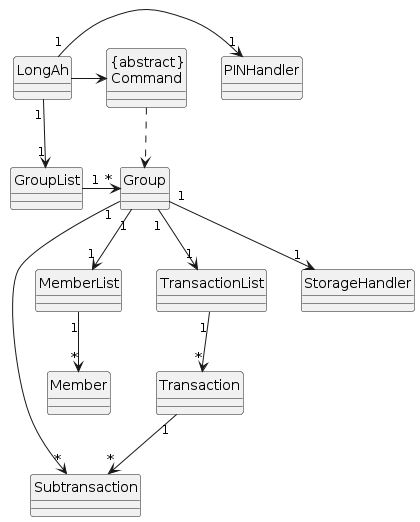
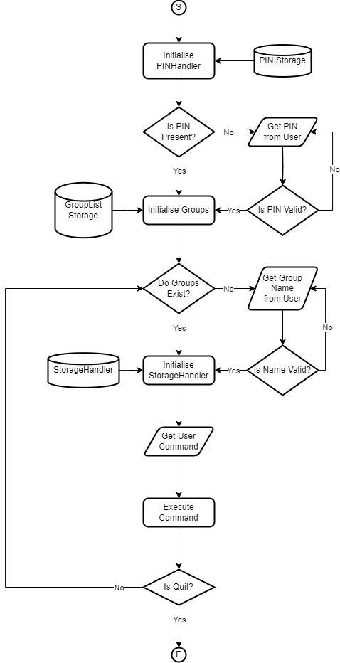
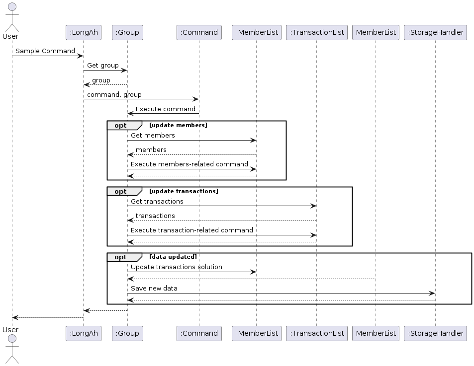
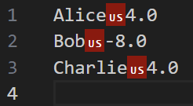
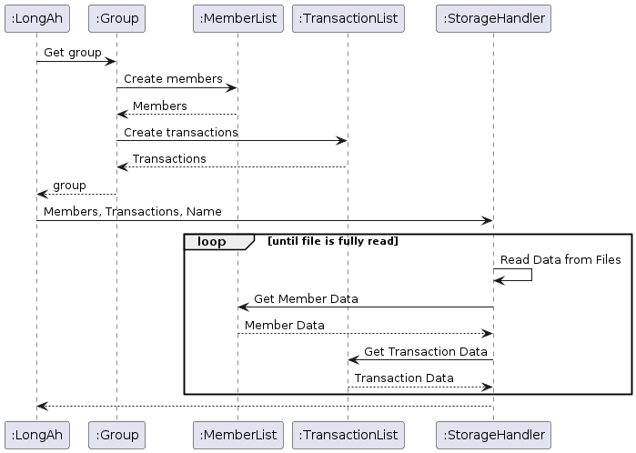
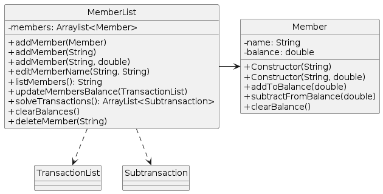
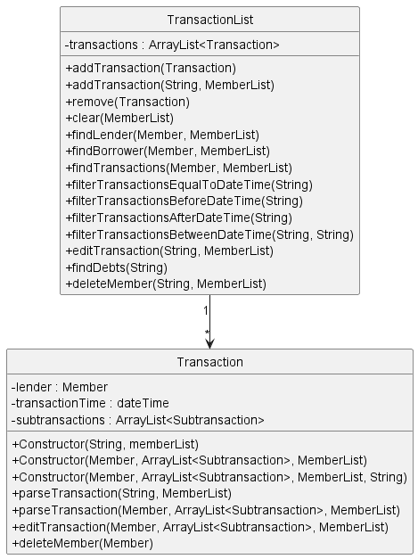

# Developer Guide

## Table of Contents
- [Developer Guide](#developer-guide)
  - [Table of Contents](#table-of-contents)
  - [Acknowledgements](#acknowledgements)
  - [Design \& Implementation](#design--implementation)
    - [UI and I/O](#ui-and-io)
    - [Commands](#commands)
    - [Storage](#storage)
    - [Group and GroupList](#group-and-grouplist)
    - [Member and MemberList](#member-and-memberlist)
    - [Transaction and TransactionList](#transaction-and-transactionlist)
    - [DateTime](#DateTime)
    - [PIN](#pin)
    - [Chart](#chart)
    - [Exceptions and Logging](#exceptions-and-logging)
  - [Product scope](#product-scope)
    - [Target user profile](#target-user-profile)
    - [Value proposition](#value-proposition)
  - [User Stories](#user-stories)
  - [Non-Functional Requirements](#non-functional-requirements)
  - [Glossary](#glossary)
  - [Instructions for Testing](#instructions-for-testing)
    - [Manual Testing](#manual-testing)
    - [JUnit Testing](#junit-testing)
    - [Text UI Testing](#text-ui-testing)
  - [Future Enhancements](#future-enhancements)

## Acknowledgements

LongAh uses the following libraries:

1. [XChart](https://knowm.org/open-source/xchart/) - Used for generating charts to visualize data.

LongAh uses the following tools for development:

1. [JUnit 5](https://junit.org/junit5/) - Used for testing.
2. [Gradle](https://gradle.org/) - Used for build automation.


## Design & Implementation

The UML diagram below provides an overview of the classes and their interactions within the LongAh application.



The high-level overview of the application is provided in the flowchart below as well.



Design and Implementation has been broken down into the subsequent sections, each tagged for ease of reference:

* [UI and I/O](#ui-and-io)
* [Commands](#commands)
* [Storage](#storage)
* [Group and GroupList](#group-and-grouplist)
* [Member and MemberList](#member-and-memberlist)
* [Transaction and TransactionList](#transaction-and-transactionlist)
* [DateTime](#DateTime)
* [PIN](#pin)
* [Chart](#chart)
* [Exceptions and Logging](#exceptions-and-logging)

### UI and I/O

<ins>Overview</ins>

The UI and I/O functionalities act as the interface between the user and the application. They are managed by the `UI` and `InputHandler` classes, respectively, with `UI` handling displaying messages to the user and reading user input, while `InputHandler` is responsible for parsing user input and returning the corresponding `Command` object.

<ins>Class Structure</ins>

The UI class has the following static attributes:

* *SEPARATOR*: A constant string representing a straight line to be printed to the console.
* *scanner*: A `Scanner` object used for reading from `System.in` I/O.

The InputHandler class itself does not have any attributes.

<ins>Methods</ins>

The `UI` class has the following key methods:

* *getUserInput*: Reads the user input from the console and returns it as a String.
* *showMessage*: Displays the provided message to the user. This is overloaded to take either a String or a String and a boolean. The latter is used to define whether a newline should be printed at the end of the String. Newline is printed by default.

The `InputHandler` class has the following key method:

* *parseInput*: Parses the user input and returns the corresponding `Command` object.

<ins>Design Considerations</ins>

* `UI` class is used as part of exception handling for displaying of error messages to the user for feedback.

### Commands

<ins>Overview</ins>

The abstract `Command` class has been implemented to introduce an additional layer of abstraction between I/O and command execution, allowing for separation of handling command keywords and executing commands.

The `Command` class has been subdivided into further packages for similar commands, such as `AddCommand` and `EditCommand`. There are other niche children classes that have not been aggregated into a package as well.

<ins>Implementation Details</ins>

The following diagram is an inheritance diagram for `Command` and its children classes. This has been heavily simplified and only shows the key commands.


The following diagram is a sequence diagram for execution of `Command`.



<ins>Class Structure</ins>

The abstract `Command` class and its related children classes have the following attributes:

* *CommandString*: String indicating the command being parsed.
* *TaskExpression*: String containing details for the command to effect.

<ins>Constructor</ins>

The `Command` constructor updates the attributes based on the input arguments.

<ins>Methods</ins>

The abstract `Command` class and its related children classes have the following method:
* *execute*: Effect the command based on the `CommandString` and the `TaskExpression`.

### Storage

<ins>Overview</ins>

The `StorageHandler` class is responsible for managing the loading and saving of data regarding members and transactions from and onto the local machine. Each `Group` calls its own `StorageHandler` object such that they maintain distinct storage directories.

<ins>Implementation Details</ins>

Each `StorageHandler` instance creates `members.txt` and `transactions.txt` in their respective subdirectories based on the name of the `Group`. The file formats are as follows, with samples provided.

* `members.txt`

```
NAME | BALANCE
```



* `transactions.txt`

```
LENDER NAME | TRANSACTION TIME(if applicable) | BORROWER1 NAME | AMOUNT1 | BORROWER2 NAME...
```


The following diagram is a sequence diagram of the initialisation of `StorageHandler`. Here, it reads data from the 2 data storage files and creates `Member` and `Transaction` objects in the associated utility list objects.



<ins>Class Structure</ins>

The StorageHandler has the following attributes:

* *storageFolderPath*: A string containing the path to the storage directory specific to the group.
* *storageMembersFilePath*: A string containing the path to the `members.txt` directory associated with the group.
* *storageTransactionsFilePath*: A string containing the path to the `transactions.txt` directory associated with the group.
* *membersFile*: A File object representing the `members.txt` file associated with the group.
* *transactionsFile*: A File object representing the `transactions.txt` file associated with the group.
* *members*: A MemberList object representing the list of Members in the group.
* *transactions*: A TransactionList object representing the list of Transactions in the group.
* *scanners*: A size 2 array of Scanners to be used for loading data from the data storage files. The first Scanner in the array is used for reading from `members.txt` while the second is used for reading from `transactions.txt`.

<ins>Constructor</ins>

The `StorageHandler` constructor creates the relevant data storage directories if they do not current exist while initializing the attributes of the object.

Key arguments for the constructor are a `MemberList` object, a `TransactionList` object and a string `groupName`. The first two are used to represent the list of `Member` objects and the list of `Transaction` objects associated with the group for reference when loading or saving data. The last represents the directory to be written to ensure that data across groups are kept discrete.

<ins>Methods</ins>

* *loadMembersData*: Reads data from `membersFile` and unpacks it before inserting `Member` objects into `MemberList`.
* *loadTransactionsData*: Reads data from `transactionsFile` and unpacks it, checking if each member exists in `MemberList` before inserting `Transaction` objects into `TransactionList`.
* *saveMembersData*: Writes packaged data from each `Member` and saves it as a record in `membersFile`.
* *saveTransactionsData*: Writes packaged data from each `Transaction` and saves it as a record in `transactionsFile`.

Data loading methods are merged in the *loadAllData* method while data saving methods are merged in the *saveAllData* method.

<ins>Usage Example</ins>

The following code segment outlines the use of `StorageHandler`.

```
import longah.util.MemberList;
import longah.util.TransactionList;

// Initialization and loading from storage
MemberList members = new MemberList();
TransactionList transactions = new TransactionList();
String name = "foo";
StorageHandler storage = new StorageHandler(members, transactions, name);

/*
At this point a subdirectory "foo" will be created if it did not previously exist
Data is loaded from "foo" to members and transactions
Assume functions modifying members and transactions are called following that.
*/

// Writing to storage
storage.saveAllData();
```

<ins>Design Considerations</ins>

* Update upon change, not upon exit - This allows for data to be saved even if the application exits ungracefully.
* *checkTransactions* - Methods are provided to have a quick check to ensure that data from data storage is not corrupted.

### Group and GroupList

<ins>Overview</ins>

The `Group` class is used to represent a group of people who have transactions among themselves. The `GroupList` class is used to represent a list of groups
stored in the application.

<ins>Class Structure</ins>

The `Group` class has the following attributes.
* *memberList*: A MemberList object representing the list of Members in the group.
* *transactionList*: A TransactionList object representing the list of Transactions in the group.
* *storage*: A StorageHandler object representing the storage handler for the group.
* *groupName*: A string representing the name of the group.
* *transactionSolution*: An array list collection of Subtransaction objects representing the least transactions solution to solving all debts in the group.

The `GroupList` class has the following static fields.
* *GROUP_LIST_FILE_PATH*: The path to the file where the group list is stored.
* *activeGroup*: A Group object representing the currently active group.
* *groupList*: An array list collection of Group objects representing the list of groups stored in the application.


<ins>Implementation Details</ins>

The detailed class diagram for `Group` and `GroupList` can be found below.


<ins>Constructor</ins>

The Group constructor creates a group object with the given group name and initializes a new member list, transaction list, storage handler. The latter is used to ensure that data across groups are kept discrete.

Key arguments of the Group constructor is a string `groupName`.

The GroupList constructor initializes an empty array list of groups for newly created groups to be added and stored to.

<ins>Methods</ins>

The `Group` class has the following key methods.
* *updateTransactionSolution*: Updates the current transaction solution of the group based on the current list of transactions.
* *settleUp*: Settles the debt of the specified member by creating a transaction with the lender(s) based on the transaction solution of the group.
* *saveAllData*: Saves the current member and transaction data of the group to the storage handler.
* *listDebts*: Returns a string representation of the current transaction solution to all debts in the group.
* *listIndivDebt*: Returns a string representation of the current transaction solution to the debt of a specified member in the group.

The `GroupList` class has the following key methods.
* *switchActiveGroup*: Switches the active group to the group with the specified name. This method is used when the user wants to switch to manage a different group.
* *createGroup*: Prompts user to enter a new group name and creates a new group with the specified name. Automatically sets it as the active group.
* *loadGroupList*: Loads the list of groups stored in the application from the storage handler.
* *addGroup*: Adds a group to the group list. This method is used when a new group is created.
* *deleteGroup*: Deletes a group from the group list based on the specified group name. The member and transaction files associated with the group are also deleted from storage.
* *saveGroupList*: Saves the list of groups stored in the groupList to the storage handler.

<ins>Usage Example</ins>

The following code segment outlines a sample use of `Group`.

```
import longah.util.TransactionList;
import longah.handler.UI;
import longah.exception.LongAhException;
import longah.node.Group;

// Creating a new group
Group myGroup = new Group("MyGroup");

// Adding members to the group
myGroup.getMemberList().addMember("Alice");
myGroup.getMemberList().addMember("Bob");
myGroup.getMemberList().addMember("Charlie");

// Adding transactions to the group
TransactionList transactions = new TransactionList();
transactions.addTransaction("Alice p/Bob a/20", myGroup.getMemberList());
transactions.addTransaction("Charlie p/Alice a/15", myGroup.getMemberList());
transactions.addTransaction("Bob p/Charlie a/10", myGroup.getMemberList());

// Setting the transactions for the group
myGroup.setTransactionList(transactions);

// Updating transaction solutions for the group
myGroup.updateTransactionSolution();

// Listing debts in the group
String debts = myGroup.listDebts();
UI.showMessage("Debts in the group:\n" + debts);

// Settling up debts for a specific member
myGroup.settleUp("Alice");

// Saving all data related to the group
myGroup.saveAllData();
```

The following code segment outlines a sample use of `GroupList`.

```
import longah.exception.LongAhException;
import longah.handler.UI;
import longah.node.GroupList;

// Creating a new GroupList instance
GroupList groupList = new GroupList();

// Creating a new group and adding it to the group list
groupList.createGroup();

// Init and add more groups to the list
Group group2 = new Group("Group1");
Group group3 = new Group("Group2");
groupList.addGroup(group2);
groupList.addGroup(group3);

// Getting the active group
UI.showMessage("Active Group: " + GroupList.getActiveGroup().getGroupName());

// Listing all groups
String allGroups = groupList.getGroupList();
UI.showMessage("All Groups:\n" + allGroups);

// Switching to a different active group
GroupList.switchActiveGroup(groupList.getGroup("Group2"));
UI.showMessage("Active Group: " + GroupList.getActiveGroup().getGroupName());

// Deleting a group from the list
groupList.deleteGroup("Group3");

// Saving the updated group list
groupList.saveGroupList();
```

<ins>Design Considerations</ins>

The Group class takes the following into consideration.
* The class ensures that group names are alphanumeric and does not allow for special characters including blank space.
* `settleUp` minimizes the number of transactions needed to settle the debt of a member by creating a single transaction with all lender(s) as borrower(s) based on the transaction solution of the group.

The GroupList class takes the following into consideration.
* `createGroup` checks if the groupList is empty and automatically prompts the user to create a new group if it is and sets it as the active group.
* `loadGroupList` is called at the start of the application to ensure that all groups are loaded from storage into the groupList.


### Member and MemberList

<ins>Overview</ins>

The `Member` class is used to represent a discrete person object, while the `MemberList` class is used to represent the aggregation members within a group.

<ins>Class Structure</ins>

The `Member` class has the following attributes.

* *name*: A string representing the name of a person within the group. Used for visual identification of each member. Name of the member is strictly alphanumeric and cannot include special characters including the blank character.
* *balance*: A double representing the amount loaned/owed by the member. A positive value indicates that the member is owed money while a negative value indicates that the member owes money.

The `MemberList` class has the following attribute.

* *members*: An array list collection of Member objects.

<ins>Implementation Details</ins>

The detailed class diagram for `Member` and `MemberList` can be found below.



<ins>Constructor</ins>

The `Member` constructor creates a member object and initialises the current balance of the member, either to 0 or to a specified value. The latter is largely only used as part of storage methods. Checking for validity of the name is performed here.

Key arguments of the `Member` constructor are a string `name` and optionally a double `balance`.

The MemberList constructor initializes an empty array list of members for newly created members to be added to.

<ins>Methods</ins>

The `Member` class has the following key methods.

* *setName*: Updates the name of a member. Used when edit member command is invoked.
* *addToBalance*: Adds the value of a transaction to a member. Absolute values are used to reduce complexity of balance update method calls for both the loaner and the borrower.
* *subtractFromBalance*: Subtracts the value of a transaction from a member. Absolute values are used to reduce complexity of balance update method calls for both the loaner and the borrower.
* *clearBalance*: Resets the current balance of a member to zero. Used then the clear command is invoked.

The MemberList class has the following key methods.

* *addMember*: Adds a member object to the current array list of members. This method is overloaded to allow for appending an existing member object or appending a newly created member object.
* *isMember*: Checks if a member object is already a part of the current array list of members.
* *getMember*: Returns the member object representation given the name of a member.
* *editMemberName*: Updates the name of an existing member based on their current name.
* *listMembers*: Returns a string representation of the current array list of members.
* *updateMembersBalance*: Updates the current balance of all members in the group based on a passed in `TransactionList` object.
* *solveTransactions*: Returns an array list of `Subtransaction` representing the least transactions solution to solving all debts in the group.
* *deleteMember*: Removes a member from the current array list of members.

<ins>Usage Example</ins>

The following code segment outlines a sample use of `Member`.

```
import longah.node.Member;
import longah.handler.UI;

// Init member with balance of 0
String name = "foo";
Member member1 = new Member(name);

// Init member with balance of 5
String name = "bar";
double balance = 5;
Member member2 = new Member(name, balance);

// Updating member balance
member1.addToBalance(5);
member2.subtractFromBalance(1.30);
member1.clearBalance();

// Print string representation of member
UI.showMessage(member1); // Using our UI methods is preferred over System.out calls
```

The following code segment outlines a sample use of `MemberList`.

```
import longah.util.MemberList

MemberList members = new MemberList();
members.addMember("Alice");
members.editMemberName("Alice", "Bob");
members.updateMembersBalance(transactions); // Assuming we have a pre-defined TransactionList object
ArrayList<Subtransaction> solution = members.solveTransactions();
members.clearBalances();
members.delete("Bob");
```

<ins>Design Considerations</ins>

The `Member` class takes the following into consideration.

* The class ensures that member names are alphanumeric and does not allow for special characters including blank space.
* This method is used in conjunction with a `TransactionList` object as part of a `Group`.

The `MemberList` class takes the following into consideration.

* `updateMembersBalance` clears current balances at the start of invocation. This removes any transactions that are not captured within the `TransactionList` object passed into the method.


### Transaction and TransactionList
<ins>Transaction Overview</ins>

The `Transaction` class is responsible for representing a single transaction in the LongAh application between 2 members.
It contains information about the lender, borrowers, and the amount involved in the transaction.

The `TransactionList` class manages a list of transactions in the LongAh application, providing methods to add, delete, and retrieve transactions from the list.

<ins>Class Structure</ins>

The Transaction class has the following attributes.

* *lender*: A member object representing the lender in the transaction.
* *transactionTime*: A DateTime object representing the time of the transaction. (optional)
* *subtransactions*: An ArrayList of Subtransaction objects, representing individual borrowings within the transaction.

The TransactionList class has the following attribute.

* *transactions*: An ArrayList of Transaction objects representing the list of transactions in a group.

<ins>Implementation Details</ins>

The detailed class diagram for `Transaction` and `TransactionList` can be found below.




<ins>Constructor</ins>

The `Transaction` constructor creates a transaction object with the specified lender and transaction time (if applicable). The subtransactions are initialized as an empty ArrayList.

Key arguments of the Transaction constructor are a `Member` object `lender`, an ArrayList of `subtransactions`, and optionally a `DateTime` object `transactionTime`.

<ins>Methods</ins>

The Transaction class has the following key methods.

- *parseTransaction*: Parses the user input to extract lender and borrowers, then adds them to the transaction.
- *editTransaction*: Edits the transaction based on new user input.
- *deleteMember*: Deletes a member from the transaction and returns true if transaction needs to be removed.

The TransactionList class has the following key methods.

- *addTransaction*: Adds a new transaction to the list based on user input.
- *remove*: Removes a transaction from the list based on the index.
- *clear*: Clears all transactions from the list.
- *findLender*: Finds all transactions where a specified member is the lender.
- *findBorrower*: Finds all transactions where a specified member is a borrower.
- *findTransactions*: Finds a transaction based on member name.
- *filterTransactionsEqualToDateTime*: Filters transactions based on the specified date and time.
- *filterTransactionsBeforeDateTime*: Filters transactions before the specified date and time.
- *filterTransactionsAfterDateTime*: Filters transactions after the specified date and time.
- *filterTransactionsBetweenDateTime*: Filters transactions between the specified start and end date and time.
- *editTransactionList*: Edits a transaction in the list based on user input.
- *findDebts*: Finds all debts owed by a specified member.
- *deleteMember*: Deletes a member from all transactions in the list.

<ins>Usage Example</ins>

The diagram below illustrates a sample usage scenario of adding a transaction: 


<ins>Design Considerations</ins>

The Transaction class takes the following into consideration.

- Separate constructors and `parseTransaction` methods for storage purposes and user input parsing respectively.
- `toStorageString` method takes in a String `delimiter` for the purpose of splitting the transaction string into its constituent parts for storage.

The TransactionList class takes the following into consideration.
- Transactions are indexed starting from 1 for user reference and ease of use by other methods such as edit and delete.


### DateTime

<ins> Overview </ins>

The DateTime class handles all operations in LongAh involving the tracking of time. This includes storing and printing
the datetime elements in dated transactions, parsing user's date & time related inputs as well as filtering transactions
according to their stored date & time. Implementation of the class is made possible with the help of the *java.time*
system class.

<ins> Class Structure </ins>

Storing requirements only occurs for the specific datetime component of the class. Hence, the class field structure is
as follows:

- *dateTime*: A dateTime object from *java.time* representing date & time associated with the current 
instance.

<ins> Constructor </ins>

The DateTime constructor takes in a string representation of date & time in the `DD-MM-YYYY HHMM` form and parse it into
a LocalDateTime instance from *java.time* and stores it under the *dateTime* field.

Invalid string date & time inputs to the constructor will trigger exceptions. The exceptions and triggering conditions
are as follows:

- `INVALID_TIME_FORMAT`: String input representing date & time is not in the `DD-MM-YYYY HHMM` format.
- `INVALID_TIME_INPUT`: String input is representing a future date & time. This is not permitted in the LongAh system
  considering real-life practicability.

<ins> Methods </ins>

- *isBefore*: Determines whether an input DateTime object has a dateTime field that is before that of the current
instance.
- *isAfter*: Determines whether an input DateTime object has a dateTime field that is after that of the current
instance.
- *isEqual*: Determines whether an input DateTime object has a dateTime field that is equal to that of the current 
instance.
- *isFuture*: Determines whether the dateTime field of the current instance represent a future date & time (e.g. is 
after the preset system time). Currently used within the constructor only.
- *toStorageString*: Formats the dateTime field of the current instance into a String output suitable for loading and 
storing.

<ins>Usage Example</ins>

The following UML diagram displays how the dateTime component is handled when the user is adding a dated transaction.


Given below is an example usage scenario of how the DateTime class behaves at each step in adding dated transactions:

1. Following steps 1-3 of the scenario of adding a new transaction, the Transaction class now identifies a potential 
presence of a dateTime component in the userExpression through the specified prefix.
2. It initiates the constructor method of the DateTime class and attempts to create a new object to store the user input 
date & time. Validation of the dateTimeExpression will occur in the DateTime class at this stage.
3. If the dateTimeExpression from the user is valid, the corresponding DateTime object will be returned to the
Transaction class as a result and stored as the dateTime of the transaction.
4. If the dateTimeExpression from the user is in the wrong format, exception occurs and the DateTime class will output 
the "Invalid dateTime format" warning through the logger.
5. If the dateTimeExpression from the user is an unrealistic future date & time, exception occurs and the DateTime class
will output the "Invalid dateTime input" warning through the logger.
6. If the dateTime component is appended successfully, the Transaction class will proceed to handle other details of the
transaction input, as per adding a normal transaction.

The following Code Snippet outlines the above usage:
```
//In pareTransaction() method of the Transaction Class 
if (splitInput[0].contains("t/")) { //Checks for the special prefix of date & time component while adding parsing user expression
  String[] splitLenderTime = splitInput[0].split("t/", 2);
  ...
  this.transactionTime = new DateTime(splitLenderTime[1]);
}
```

The following UML diagram displays how the dateTime component is handled when printout requests are initiated for dated 
transactions.


Given below is an example usage scenario of how the DateTime class behaves at each step when printouts are required:
1. A String printout request is sent to the Transaction Class. 
2. If the transaction has a dateTime component, proceed with sending a String printout request further to the DateTime
class.
3. The DateTime class formats the dateTime object of the current transaction into a String representation suitable for
printout and returns this result back to Transaction class.
4. The transaction class appends the returned String representation to the existing printout String.

The following Code Snippet outlines the above usage:
```
//In toString() method of the Transaction Class 
if (this.haveTime()) { //Checks whether the current transaction has a dateTime component
    time = "Transaction time: " + this.transactionTime + "\n"; //Initiates a toString() call to the DateTime class
}
```

The following UML diagram displays how the dateTime component is compared with user inputs in time filtering methods 
(e.g. in *filterTransactionsEqualToDateTime*).


Given below is an example usage scenario of how the DateTime class behaves at each step when comparison is initiated by
filter methods.
1. Upon receiving a filtering request, the TransactionList class first initiates the DateTime constructor and attempts 
to store the user's dateTime Expression into a DateTime object.
2. After the successful creation of the userDateTime object, the filtering method proceeds by looping through all 
transactions in the current list. 
3. For every transaction, the Transaction List first gets the dateTime object of the transaction by calling the 
getTransactionTime() method of the Transaction class.
4. A comparison request (in this case .isEqual()) of the DateTime class is initiated, comparing the transactionDateTime
as well as userDateTime objects of the class.
5. Depending on the Boolean value determining the result of comparison, the filtering method will then proceed to decide
if the current transaction is to be added to the printout.

The following Code Snippet outlines the above usage:
```
//In filterTransactionsEqualToDateTime() method of the TransactionList Class 
DateTime dateTimeToCompare = new DateTime(dateTime); //Stores user expression into a DateTime object
...
for (Transaction transaction : this.transactions) {
    ...
    if (transaction.getTransactionTime().isEqual(dateTimeToCompare)) { //Compares the two DateTime objects using .isEqual() comparison method
        ...
}
```

<ins> Design Considerations </ins>

To reduce the coupling of time-related operations with other classes as much as possible, the following precautions was
put in-placed during the development of the DateTime class.

- Isolation of dateTime checks: The validity of all dateTime inputs of LongAh is only checked and handled within the
constructor of the DateTime class.
- Isolation of comparison methods: dateTime fields are only accessed and compared through defined methods of the 
DateTime class.
- Isolation of printouts: All dateTime fields are formatted and output only through the toString() method.

The above methods effectively contains all time handling under the single DateTime class. This allows developer to 
change the input and output structure of time-related behaviors(e.g. formatting of time in printouts) easily without 
compromising compatibility with other parts of the LongAh system.

### PIN

<ins> Overview </ins>

The `PINHandler` class is responsible for managing the creation, loading, authentication, and resetting of a
Personal Identification Number (PIN) used for authentication in the LongAh application. It uses SHA-256 hashing to
securely store and compare PINs. The PINHandler class interacts with the StorageHandler class to save and load the PIN
and authentication status.

Note: PIN is disabled by default and needs to be set upon first startup.

<ins>Implementation Details </ins>

*Data Storage:*

The PIN and authentication enabled status are saved in a file located at ./data/pin.txt.
The file format is as follows:

`hashed PIN`<br />
`authenticationEnabled`<br />

<ins> Class Structure </ins>

The `PINHandler` class has the following static fields:

- *PIN_FILE_PATH*: The path to the file where the PIN and authentication status are saved.
- *savedPin*: The hashed PIN saved in the file.
- *authenticationEnabled*: A boolean flag indicating whether authentication is enabled.

<ins> Constructor </ins>

The `PINHandler` constructor initializes the savedPin and authenticationEnabled fields by loading them from the file using
the loadPinAndAuthenticationEnabled method.

If the file does not exist or the savedPin is empty, it calls the createPin method to create a new PIN.

<ins> Methods </ins>

- *loadPinAndAuthenticationEnabled*: Loads the saved PIN and authentication enabled status from the file.
- *savePinAndAuthenticationEnabled*: Saves the PIN and authentication enabled status to the file.
- *getPinFilePath*: Returns the file path of the PIN file.
- *createPin*: Prompts the user to create a new 6-digit PIN and hashes it before saving.
- *authenticate*: Authenticates the user by comparing the entered PIN with the saved PIN.
- *resetPin*: Resets the PIN for the user by prompting for the current PIN and creating a new PIN if the current

PIN is correct.
- *enablePin*: Enables authentication upon startup.
- *disablePin*: Disables authentication upon startup.
- *getSavedPin*: Returns the saved PIN.
- *getAuthenticationStatus*: Returns the authentication status.

<ins> Usage Example </ins>

The following diagram illustrates the sequence during PIN authentication.


This diagram shows the sequence when the user resets their PIN.


Given below is an example usage scenario and how the PIN creation and authentication mechanism behaves at each step:

1. The user launches the application for the first time. The PINHandler initializes, loading the saved PIN and 
authentication enabled status from the file. If no PIN exists, it prompts the user to create a new PIN.
2. The user creates a new 6-digit PIN using the createPin method. The entered PIN is hashed using SHA-256 before 
saving it to the file.
3. The user enables authentication upon startup using the 'pin enable' command. The authenticationEnabled flag is set to True and saved to the file.
4. The user closes the application and relaunches it. The PINHandler loads the saved PIN and authentication 
enabled status from the file again.
5. The user attempts to log in by entering their PIN. The authenticate method hashes the entered PIN and 
compares it with the saved hashed PIN. If they match, the user is successfully authenticated. Otherwise, the user is denied access.
6. The user decides to reset their PIN by entering their current PIN and creating a new one using the resetPin 
method.
7. The user disables authentication upon startup using the 'pin disable' command. The authenticationEnabled flag 
is set to false and saved to the file.
8. The user relaunches the application, and authentication is no longer required since it has been disabled. 
The user can proceed with the application and do any actions without entering a PIN.

Code Snippet
```
// Initialize PINHandler
PINHandler pinHandler = new PINHandler();

// Check if authentication is enabled
if (PINHandler.getAuthenticationStatus()) {
// Authenticate user
PINHandler.authenticate();
} else {
// Authentication is disabled, proceed with application logic
}
```

<ins> Design Considerations </ins>

Resetting PIN: The resetPin() method allows users to change their PIN by first verifying their current PIN. This adds
an extra layer of security to prevent unauthorized PIN changes.

Authentication Management: Users have the option to enable or disable authentication upon startup using the 'pin enable'
and 'pin disable' commands. This flexibility allows users to customize their authentication preferences based on their
security needs and convenience.

### Chart

<ins>Overview</ins>

The `Chart` class is responsible for generating a visual representation of the transaction solution in the form of a chart.

The chart is displayed in a separate window and shows the individual balances among the group members.

This is handled using a package called 'XChart'.

It provides a convenient way to visualize data, particularly for member balances in the LongAh application. The bar chart generated by this class showcases positive and negative balances of members, offering insights into financial statuses.

<ins>Implementation Details</ins>

Data Representation:

The `Chart` class utilizes the XChart library to represent data in the form of bar charts. It distinguishes positive and negative balances by differentiating them with green and red colors, respectively.


<ins>Class Structure</ins>

The `Chart` class consists of the following components:

- *Constructor*: Instantiates a new Chart object by displaying the provided category chart.

<ins>Methods</ins>

- *viewBalancesBarChart*(List<String> members, List<Double> balances): Generates a bar chart displaying member balances. It
  distinguishes positive and negative balances and adds tooltips for enhanced user interaction. Additionally, it includes
  an annotation recommending a command for managing debts effectively.

<ins>Usage Example</ins>

Given below is an example usage scenario and how the Chart class behaves at each step:

1. The user adds a few members to the group and performs transactions among them.
2. The user enters the 'chart' command to view the current balances of all members.

Code Snippet
```
// Prepare data
List<String> members = Arrays.asList("Member1", "Member2", "Member3");
List<Double> balances = Arrays.asList(100.0, -50.0, 75.0);

// Display bar chart
Chart.viewBalancesBarChart(members, balances);
```
<ins>Design Considerations</ins>

Data Visualization:

The class focuses on providing clear and concise visualization of member balances through bar
charts, aiding users in understanding financial distributions.

Interactivity:

Tooltips are enabled to enhance user interaction, providing insights into specific data points when
hovered over.

Annotation: An annotation is included to suggest a command for managing debts efficiently, ensuring users
are aware of available features within the application.


### Exceptions and Logging

<ins>Overview</ins>

This project makes used of centralised exception handling and logging means, allowing for greater standardisation throughout the codebase. This is done through the `LongAhException` class and `Logging` class respectively.

<ins>Implementation Details</ins>

The `LongAhException` class makes use of enumerations `ExceptionMessage` and `ExceptionType` to dictate its behaviour. `ExceptionMessage` stores the desired output message for each kind of potential error along with its associated `ExceptionType`. `ExceptionType` is used to define the manner in which the exception is logged.

Note: All exception calls are logged by default, either as WARNING or INFO depending on the `ExceptionType` classification tagged to the `ExceptionMessage`.

<ins>Class Structure</ins>

The `LongAhException` class has the following static field:
* *type*: A ExceptionType enumeration denoting how the exception should be logged.

The `Logging` class has the following static field:
* *longAhLogger*: A Logger type object to perform the logging.

<ins>Constructor</ins>

The `LongAhException` class calls the Exception constructor using the message associated with the received ExceptionMessage and stores the type of exception.

The `Logging` class initializes a file directory to store logging data.

<ins>Methods</ins>

The `LongAhException` class has the following key methods:

* *printException*: Prints the desired output message when an exception is thrown.

The `Logging` class has the following key methods:

* *logInfo*: Takes a string `message` as an argument. Create a log at the INFO level.
* *logWarning*: Takes a string `message` as an argument. Create a log at the WARNING level.

<ins>Usage Example</ins>

Use of the `LongAhException` class is demonstrated below, including throwing of an exception and printing the desired output message. This example covers the throwing exception due to invalid index.
```
import longah.exception.LongAhException;
import longah.exception.ExceptionMessage;

// Throw an exception
throw new LongAhException(ExceptionMessage.INVALID_INDEX);

// Catch exception and output desired message
catch (LongAhException e) {
    LongAhException.printException(e);
}
```

`Logging` can be performed using the following lines of code:
```
import longah.handler.Logging;

// Create log of INFO Level
Logging.logInfo(message);

// Create log of WARNING Level
Logging.logWarning(message);
```

## Product scope

### Target user profile

Busy people with large transaction quantities among friends

### Value proposition

- Help users to find the least transactions solution to a large quantity of transactions
- Allow users to view past expenses of a group

## User Stories

| Version | As a ...       | I want to ...                                                                                                    | So that I can ...                                                                                  |
|---------|----------------|------------------------------------------------------------------------------------------------------------------|----------------------------------------------------------------------------------------------------|
| v1.0    | user           | to be able to find the least transactions needed to resolve amounts owed by various members of my various groups | -                                                                                                  |
| v1.0    | user           | add transactions involving multiple people in a group                                                            | keep track of people involved and value of the transaction                                         |
| v1.0    | user           | edit transactions                                                                                                | fix mistakes made when entering transactions                                                       |
| v1.0    | user           | delete transactions                                                                                              | clear erroneous transactions which I do not intend to keep                                         |
| v1.0    | user           | keep a log of my data                                                                                            | retain memory of past transactions in past runs of the platform                                    |
| v1.0    | user           | have easy access command to clear my pending debts                                                               | -                                                                                                  |
| v1.0    | user           | be able to organise people into groups                                                                           | minimise the occurrence of being affected by typos                                                 |
| v1.0    | user           | add members to a group                                                                                           | add them to future transactions                                                                    |
| v1.0    | user           | restart data for a group                                                                                         | reduce clutter of the application                                                                  |
| v1.0    | user           | be able to organise people into groups                                                                           | minimise the occurence of being affected by typos                                                  |
| v1.0    | user           | add members to a group                                                                                           | add them to future transactions                                                                    |
| v1.0    | user           | restart data for a group                                                                                         | reduce clutter of the application                                                                  |
| v1.0    | user           | find transactions related to a certain member                                                                    | better keep track of my pending transactions or payments                                           |
| v2.0    | new user       | view help commands                                                                                               | have an easy reference for commands while using the application                                    |
| v2.0    | user           | enable the use of passwords for my application                                                                   | prevent wrongful access to my records                                                              |
| v2.0    | user           | disable the password                                                                                             | have an easier time allowing people to view my records                                             |
| v2.0    | user           | edit my password                                                                                                 | change my password in case it has been compromised                                                 |
| v2.0    | user           | have my password be encrypted                                                                                    | ensure my password cannot be easily found out                                                      |
| v2.0    | user           | edit members in my group                                                                                         | change their nicknames which I store within the application                                        |
| v2.0    | user           | delete current members                                                                                           | keep my groups neat and free of people who are no longer part of them                              |
| v2.0    | user           | create more groups                                                                                               | use the application for multiple groups of friends without data overlapping                        |
| v2.0    | forgetful user | time of transactions to be saved                                                                                 | reference when each transaction were made                                                          |
| v2.0    | user           | search for specific transactions                                                                                 | find out information relating to the transaction in case I need to affect it                       |
| v2.1    | advanced user  | merge different groups together                                                                                  | combine groups which have large overlaps in members                                                |
| v2.1    | user           | filter transactions based on transaction time                                                                    | easily reference a transaction made during an interested time period                               |
| v2.1    | user           | setup expenditure limits                                                                                         | be notified when someone have too large of a debt                                                  |
| v2.1    | advanced user  | create equal share transactions                                                                                  | add multiple people to a transaction without having to type their associated value to each of them |
| v2.1    | advanced user  | have command shortcuts                                                                                           | input commands faster                                                                              |

## Non-Functional Requirements

* Technical Requirements: Any mainstream OS, i.e. Windows, macOS or Linux, with Java 11 installed. Instructions for downloading Java 11 can be found [here](https://www.oracle.com/sg/java/technologies/javase/jdk11-archive-downloads.html).
* Project Scope Constraints: The application should only be used for tracking. It is not meant to be involved in any form of monetary transaction.
* Project Scope Constraints: Data storage is only to be performed locally.
* Quality Requirements: The application should be able to be used effectively by a novice with little experience with CLIs.

## Glossary

* Lender - Member making payments on behalf of other members.
* Borrower - Members being paid for by the lender.
* Transaction - Payment made by ONE Lender on behalf of MULTIPLE Borrower, represented as a list of Subtransaction.
* Subtransaction - Subset of Transaction, consists of ONE Lender and ONE Borrower.
* Group - Discrete units each containing their respective lists of Member and Transaction.
* Separator - "\|" has been used to denote separator within this document but within the Storage related classes, the ASCII Unit Separator as denoted by ASCII 31 is used instead. This is defined within `StorageHandler`.

## Instructions for Testing

### Manual Testing

View the [User Guide](UserGuide.md) for the full list of UI commands and their related use case and expected outcomes.

### JUnit Testing

JUnit tests are written in the [`test directory`](../src/test/java/longah/) and serve to test key methods part of the application.

### Text UI Testing

Files relating to Text UI Testing can be found [here](../text-ui-test/).

When running tests on a Windows system, run the following command from the specified directory:
```
./runtest.bat
```

When running tests on a UNIX-based system, run the following command from the specified directory:
```
./runtest.sh
```

## Future Enhancements

1. Allow methods for undo-ing previous commands.
2. Add page-scrolling for `list`, `find` and `filter` commands to reduce screen clogging.
3. Inclusion of anomaly detection algorithms to flag out potentially erroneous transactions.
4. Adding of further details tagged to each transaction and allow for searching of transactions based on these details.
5. Create a reminder system to inform users of upcoming events or to warn them to settle payments.
6. Allow the setting up of recurring transactions such as credit is deducted periodically.
